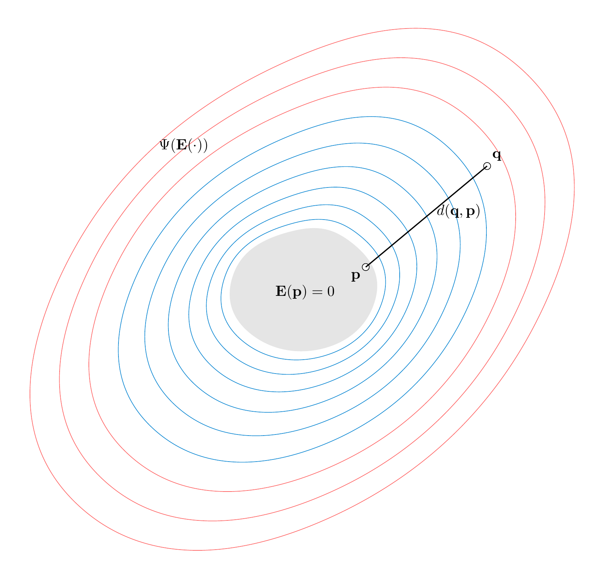
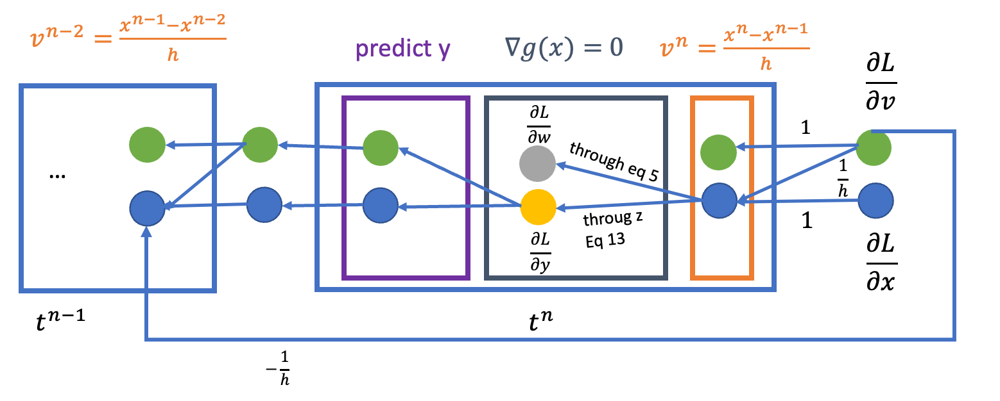

# Projective Dynamics & DiffPD
## Mathematical Background
A-Norm Reminder: $\|x\|_A^2=x^TAx$

Newton-Raphson Optimization:
+ good: quadratic convergence
+ bad: Hessian computation at each iteration (not simple)
+ bad: linear system solve at each iteration (not efficient)
+ bad: safeguards necessary -- indefinite Hessian (not robust)

## Projective Dynamics Object Function

Starting from implicit Euler:

```math
q_{n+1}=q_n+hv_{n+1}
```

```math
v_{n+1}=v_n+h\mathbf{M}^{-1}(f_{int}(q_{n+1})+f_{ext})
```

Combine them together (the same as in XPBD):

```math
\mathbf{M}(q_{n+1}-q_n-hv_n)=h^2(f_{int}(q_{n+1})+f_{ext})
```

Operator splitting, using $f_{ext}$ to predict a candidate $s_n=q_n+hv_n+h^2\mathbf{M}^{-1}f_{ext}$, get the same minimization problem as in XPBD:

```math
M(q_{n+1}-s_n)+h^2\sum_i\nabla W_i(q_{n+1})=0
```

```math
\frac{M}{h^2}(q_{n+1}-s_n)+\sum_i\nabla W_i(q_{n+1})=0
```

which is the gradient of the following object function. So this is equivalent to require the gradient to be 0, as the function value is larger or equal to 0, this is further equivalent to require its minimum value and corresponding unknown variable $q$ :

```math
\min_{q^{n+1}}\frac{1}{2h^2}\|\mathbf{M}^{\frac{1}{2}}(q_{n+1}-s_n)\|_F^2+\sum_iW_i(q_{n+1})
```

where the first part measures the prediction closeness, the second part measures energy potential.

## PD's Treatment of Elastic Energy

In continuum mechanics, we use $E$ to measure the elemental strain, and $\Psi$ to measure material model. Strain $E$ both defines the constraint of the manifold to be zero and uses $\Psi$ to measure the distance.



Unlike XPBD, PD decouples the energy potential into a **distance measure** $d(p,q)$ and a constraint indicator $\delta_E(p)$:

```math
W(q,p)=d(p,q)+\delta_E(p)
```

The indicator forces $\mathbf{p}$ to lie on the constraint manifold, while $d$ measures how far the current configuration $\mathbf{q}$ is from $\mathbf{p}$. Minimizing over $\mathbf{p}$ projects $\mathbf{q}$ onto the manifold (local step); minimizing over $\mathbf{q}$ with fixed $\mathbf{p}$ becomes a simple quadratic problem (global step).

The distance is measured in a quadratic form, so that the potential $W$ can be further written as:

```math
W(q,p)=\frac{w}{2}\|Aq-Bp\|_F^2+\delta_C(p)
```

In implementation, we do not need to evaluate the complex nonlinear strain energy $\Psi(E(q))$ directly. Instead, the nonlinearity is handled by the projection onto the constraint set (local step), while the distance measure remains a simple quadratic function, enabling a constant system matrix that can be prefactored.

A and B are constant matrices and $w$ is a nonnegative weight (like stiffness in XPBD). The system matrix is constant as long as the constraints are not changing and therefore can be prefactored at initialization, which is also important for diffPD.

### Local-Global Solver
Reforming the object function as:

```math
\frac{1}{2h^2}\|M^\frac{1}{2}(q-s_n)\|_F^2+\sum_i\frac{w_i}{2}\|A_iS_iq-B_ip_i\|_F^2+\delta_{C_i}(p_i)
```

where $S$ is a selection matrix, selecting the corresponding $q$ in constraint $i$.

Searching for the $q$ to make it minimal, we iterate over two steps. The local part solves the second and third term, which is finding a set of suitable $p$ for each constraint and each temporal $q$. The global part makes a compromise between the temporal $p$ (could be multiple $p$ for one $q$) and the prediction $s$. This is a block coordinate descent approach: alternating between optimizing $p$ (local) and $q$ (global).

### Choice of $A_i$, $B_i$
$A_i$ and $B_i$ are per-constraint matrices that define the distance metric, which are constant through simulation. In implementation, they are chosen as differential coordinate matrices. This choice is based on the fact that internal physical constraints are translation invariant. So something like $[[1,-1],[-1,1]]$

### Local Solve

```math
\min_{p_i}\frac{w_i}{2}\|A_iS_iq-B_ip_i\|_F^2+\delta_{C_i}(p_i)
```

This depends on the constraint type and the optimization method on local constraint. See the original paper section 5 and the appendix part.

### Global Solve

```math
\min_{q}\frac{1}{2h^2}\|M^\frac{1}{2}(q-s_n)\|_F^2+\sum_i\frac{w_i}{2}\|A_iS_iq-B_ip_i\|_F^2
```

is equivalent to let the gradient of the function to be 0,

```math
\frac{M}{h^2}(q-s_n)+\sum_i w_i(A_iS_i)^T(A_iS_iq-B_ip_i)=0
```

```math
\frac{M}{h^2}(q-s_n)+\sum_i w_iS_i^TA_i^TA_iS_iq=\sum_i w_iS_i^TA_i^TB_ip_i
```

```math
\left(\frac{M}{h^2}+\sum_i w_iS_i^TA_i^TA_iS_i\right)q=\frac{M}{h^2}s_n+\sum_i w_iS_i^TA_i^TB_ip_i
```

### Algorithm: Projective Implicit Euler Solver

1. $\mathbf{s}_n = \mathbf{q}_n + h\mathbf{v}_n + h^2\mathbf{M}^{-1}\mathbf{f}_{ext}$
2. $\mathbf{q}_{n+1} = \mathbf{s}_n$
3. **loop** *solverIteration* times:
   1. **for all** constraints $i$:
      - $\mathbf{p}_i = \text{ProjectOnConstraintSet}(\mathbf{C}_i, \mathbf{q}_{n+1})$
   2. $\mathbf{q}_{n+1} = \text{SolveLinearSystem}(\mathbf{s}_n, \mathbf{p}_1, \mathbf{p}_2, \mathbf{p}_3, \ldots)$
4. $\mathbf{v}_{n+1} = (\mathbf{q}_{n+1} - \mathbf{q}_n) / h$

The original video of the paper gives a good explanation of the whole simulation process.

## Implementation
### Prefactorize (Important for DiffPD)

The global function can be further reformulated into $Aq=b$, where the matrix $A$ is constant over time and can be precalculated during the initial step. The rhs changes every iteration but can be calculated quickly. Since $A$ is also positive-definite, we can use Cholesky decomposition with C++ Eigen library to speed up the simulation. This prefactorization is also critical for DiffPD: the backward pass reuses the same Cholesky decomposition of $\mathbf{A}$ to solve the adjoint system, avoiding expensive refactorization at each timestep.

### Parallelization
PD uses a Jacobi-style solver rather than the Gauss-Seidel approach used in PBD/XPBD for two reasons. First, the local step projects all constraints independently, which is trivially parallelizable. Second, the global step considers all constraints simultaneously, making the solution independent of constraint ordering and avoiding the oscillation problem that Gauss-Seidel exhibits when constraints are incompatible.

## Limitation
1. Implicit damping from the implicit Euler time integrator causes non-physical energy dissipation.
2. No hard constraints: all constraints are treated as soft penalties; increasing weights to approximate hard constraints degrades the conditioning of the global system matrix and leads to locking artifacts.
3. Non-linear material models (e.g., Neo-Hookean, StVK) cannot be supported while preserving PD's key advantage of a constant, prefactorizable system matrix.

# DiffPD
## Backpropagation with implicit time integration

Rewrite the whole object function into:

```math
g(x)=\frac{1}{2h^2}(x-y)^TM(x-y)+E(x)
```

where $y$ is the prediction under external forces, and $x$ is the final particle position. And the minimum value corresponds to the gradient being 0:

```math
\nabla g(x)=\frac{1}{h^2}M(x-y)+\nabla E(x)=0
```

Differentiate it with respect to $y$, we obtain:

```math
\frac{\partial {\nabla g(x)}}{\partial{x}}\frac{\partial{x}}{\partial{y}}+\frac{\partial \nabla g(x)}{\partial y}=\frac{\partial}{\partial y}0
```

since $x$ also depends on prediction $y$.

```math
\frac{\partial}{\partial \mathbf{x}}\left[\frac{1}{h^2}\mathbf{M}(\mathbf{x}-\mathbf{y})+\nabla E(\mathbf{x})\right]\frac{\partial \mathbf{x}}{\partial \mathbf{y}}+\frac{\partial}{\partial \mathbf{y}}\left[\frac{1}{h^2}\mathbf{M}(\mathbf{x}-\mathbf{y})\right]=0
```

```math
\left[\frac{1}{h^2}\mathbf{M}+\nabla^2 E(\mathbf{x})\right]\frac{\partial \mathbf{x}}{\partial \mathbf{y}}-\frac{1}{h^2}\mathbf{M}=0
```

where $\left[\frac{1}{h^2}\mathbf{M}+\nabla^2 E(\mathbf{x})\right]$ is $\nabla^2g(x)$, and this yields:

```math
\frac{\partial \mathbf{x}}{\partial \mathbf{y}}=\frac{1}{h^2}[\nabla^2 g(\mathbf{x})]^{-1}\mathbf{M}
```

With this, if we define a loss function $L$ on position $x$, we can apply the chain rule:

```math
\frac{\partial L}{\partial y}=\frac{\partial L}{\partial x}\frac{\partial x}{\partial y}=\frac{1}{h^2}\frac{\partial L}{\partial x}[\nabla^2 g(\mathbf{x})]^{-1}\mathbf{M}
```

where we let $z^T=\frac{\partial L}{\partial x}[\nabla^2 g(\mathbf{x})]^{-1}$, to avoid the multiplication involving the inversion of a matrix. And the calculation is further simplified with

```math
\nabla^2g(x)z=\left(\frac{\partial L}{\partial x}\right)^T
```

as $\nabla^2g(x)$ is symmetric. And the problem is equivalent to solve $Az=b$.

```math
\frac{\partial L}{\partial y}=\frac{1}{h^2}z^TM
```

## Efficiently Computing the Hessian

The energy potential in PD (reformulation of the original PD, where $\delta$ is absorbed in $\min$ and $G_c=A_cS_c$, $B_c$ is also absorbed in $p_c$):

```math
E_c(x)=\min_{p_c\in \mathcal{M}_c}\frac{w_c}{2}\|G_cx-p_c\|_F^2
```

The global solver solves:

```math
\left(\frac{1}{h^2}M+\sum_cw_cG_c^TG_c\right)x=\frac{1}{h^2}My+\sum_cw_cG_c^Tp_c
```

With this definition, we can get $\nabla E$ and $\nabla^2 E$:

```math
\nabla E(x)=\sum_c w_cG_c^T(G_cx-p_c)
```

```math
\nabla^2E(x)=\sum_cw_cG_c^TG_c-\sum_c w_cG_c^T\frac{\partial p_c}{\partial x}
```

$\frac{\partial p_c}{\partial x}$ in $\nabla E(x)$ can be ignored because of the envelope theorem. Putting into the Hessian:

```math
\nabla^2g(x)=\frac{1}{h^2}M+\sum_c w_cG_c^TG_c-\sum_c w_cG_c^T\frac{\partial p_c}{\partial x}=A-\Delta A
```

where $\Delta A = \sum_c w_cG_c^T\frac{\partial p_c}{\partial x}$. The matrix splitting $\nabla^2g=A-\Delta A$ suggests the iterative solver:

```math
Az^{k+1}=\Delta Az^k+\left(\frac{\partial L}{\partial x}\right)^T
```

This can be viewed as two steps: first locally for each constraint compute $\Delta A z$, then globally solve for new $z$.

### Algorithm: PD Backpropagation in One Timestep

**Input:** $\mathbf{y}$, $\mathbf{x}$ (from forward simulation), and $\frac{\partial L}{\partial \mathbf{x}}$

**Output:** $\frac{\partial L}{\partial \mathbf{y}}$

1. Initialize $\mathbf{z} = \mathbf{0}$
2. **loop** *solverIteration* times:
   1. **for all** constraints $c$:
      - $\Delta\mathbf{A}\mathbf{z}_c = w_c \mathbf{G}_c^\top \frac{\partial \mathbf{p}_c}{\partial \mathbf{e}} (\mathbf{G}_c \mathbf{z})$
   2. $\mathbf{z} = \mathbf{A}^{-1}\left(\Delta\mathbf{A}\mathbf{z} + \left(\frac{\partial L}{\partial \mathbf{x}}\right)^\top\right)$
3. $\frac{\partial L}{\partial \mathbf{y}} = \frac{1}{h^2} \mathbf{z}^\top \mathbf{M}$

### Whole View of the Backpropagation



# References
- **[Bouaziz et al. 2014]** Bouaziz, S., Martin, S., Liu, T., Kavan, L., Pauly, M. *Projective Dynamics: Fusing Constraint Projections for Fast Simulation.* ACM Trans. Graph. 33(4), 2014. [DOI](https://doi.org/10.1145/2601097.2601116)
- **[Du et al. 2021]** Du, T., Wu, K., Ma, P., Wah, S., Spielberg, A., Rus, D., Matusik, W. *DiffPD: Differentiable Projective Dynamics.* ACM Trans. Graph. 41(2), 2021. [DOI](https://doi.org/10.1145/3490168)
